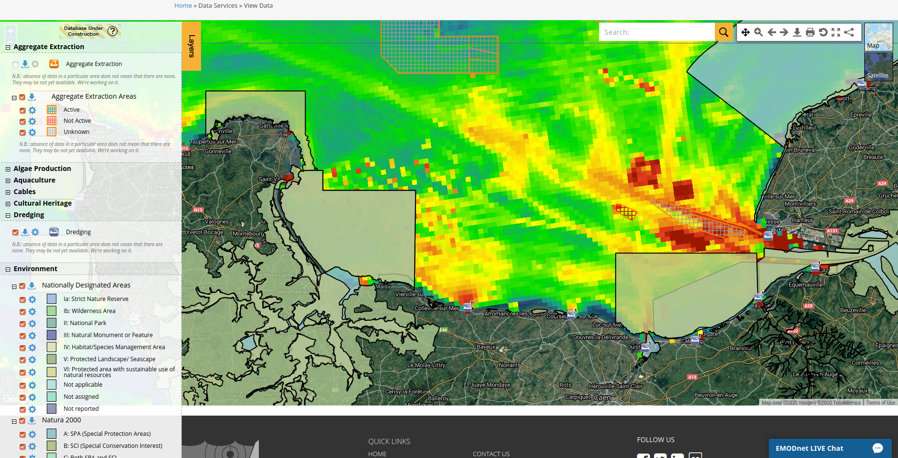

```{r compil, include=FALSE,eval=F}
rmarkdown::render("dataportal.Rmd")
```

```{r setup, include=FALSE}
knitr::opts_chunk$set(echo = FALSE)
```

# Les données marines

### Données marines I

Acquérir des données sur le milieu marin est :

- difficile : moyen de navigation, condition de navigation... 
- coûteux : moyen de navigation, instrumentations (in situ, satellites, drones),
  infrastructure (pêche, AIS)...



### Données marines II

La valeur de l'information collectée est donc élevée et les moyens d'acquisition
étant opérés générallement par des entités gouvernementales, il est nécessaire
d'assurer la mise à disposition des données pour l'ensemble des acteurs privés
et publics concernés par le domaine maritime.

**Les portails de diffusion de données marines assurent cet objectif.** 

D'une manière plus générale, en Europe, la directive INSPIRE vise à établir une
infrastructure de données géographiques pour assurer l'interopérabilité en
bases et données et faciliter la diffusion, la disponibilité, l'utilisation et
la réutilisation de l'information collectée (voir la convention d'Aarhus pour la
mise en place d'un droit d'accès du public aux informations environnementales).
  

# Portails de diffusion de données marines

### Les portails I

~Europe :

- données marines hors satellites : **EMODNET** <www.emodnet.eu>
- données satellitales, in situ et modèles : **COPERNICUS Marine Environement Monitoring Service** <marine.copernicus.eu>
- pêche : **JRC fisheries data collection** <datacollection.jrc.ec.europa.eu>, **eurostat**
  <ec.europa.eu/eurostat/>, **ICES** <www.ices.dk>
- ...

~Monde :

- données biologiques :  **GBIF** <www.gbif.org>
- données satellitales : **PODAAC** <podaac.jpl.nasa.gov>
- ...

### Les portails II

- La liste précédente ne prétend pas à l'exhaustivité.
- De nombreux autres portails existent liés à des instituts ou des pays (Ifremer :
Sextant...).
- Les banques de données de dépôts de jeu de données contiennent aussi des données relatives au milieu marin (Ifremer : Seanoe, Zenodo...).
- Si les portails de diffusion proposent des outils de visualisation et
d'extraction simplifiée de la donnée, les banques de données ne proposent que
des fichiers bruts de données.

# EMODNET

### EMODNET

www.emodnet.eu

- contenu : un portail de données comportant 7 sections (bathymétrie, géologie,
  typologie des fonds, chimie, biologie, physique, activités humaines) diffusant
  des informations vectorielles et raster.
- gouvernance : un secrétariat contractualisé par l'UE coordonne la participation de 150 organisations
  pour la collecte de l'information et sa mise à disposition en Europe. 
- un possibilité de soumettre les données collectées dans cette infrastructure à
  travers le data ingestion portal.


# Copernicus

### COPERNICUS Marine Environement Monitoring Service 

marine.copernicus.eu

- contenu : données d'observation in situ, satellitales et de modélisation
- gouvernance : piloté par le directorat de l'UE Entreprise et Industrie,
  COPERNICUS est un programme visant à assurer la capacité européenne
  d'observation de la Terre. La coordination marine est assurée par Mercator Ocean, le
  centre d'analyse et de prévision de l'océan en France.
- élaboration d'un rapport annuel sur l'état de l'environnement marin vu par
  ces données


# Service web

### Service web ?

Exemple :

Sans service web :

-  [1] téléchargement du fichier, mise au format, lecture, extraction de la zone d'intérêt puis [2] analyses, discussion
- si une mise à jour de l'information est disponible répétée [1] puis [2]

Avec un service web :

- [1] connection au serveur de données par le biais d'un service web =
  téléchagement+mise au format+lecture+extraction de la zone d'intérêt 
- [2] analyse et discussion
- si la donnée est mise à jour, [1] est mis à jour automatiquement répéter
  uniquement [2]

### Service web 

Un service web est un protocole d'interface informatique permettant la
communication et l'échange de données entre applications et systèmes
hétérogènes^[https://fr.wikipedia.org/wiki/Service_webr].

Pour l'information géographique :

- wms (web map services) : cartes (images)
- wfs (web feature service) : polygones
- wcs (web coverage services) : récupération de la donnée
- ...

Ces protocoles sont à priviligier pour travailler sur la donnée issue de
portails.

(Un exemple avec QGIS ?)

# Conclusion

### Conclusion

Pourquoi cette introduction ?

Pour une étude sur une zone donnée, les portails d'accès aux données marines
permettent de :

- prendre connaissance de l'information disponible sur le milieu avant une
  campagne d'échantillonnage et donc d'affiner le protocole d'échantillonnage
- compléter l'information collectée (dynamique, typologie des fonds...)

Publier des données collectées sur un portail (data ingestion d'emodnet par
exemple) permet de :

- valoriser l'information collectée hors du cadre de l'étude
- aux autres acteurs du domaine maritime de bénéficier des points précédents

\begin{center}
*Libérer l'accès aux données marines !*
\end{center}
