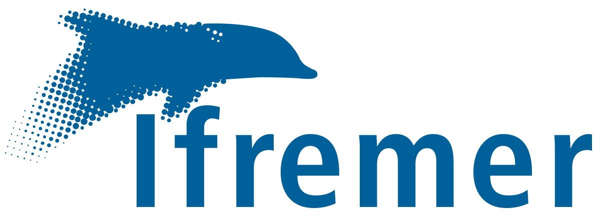
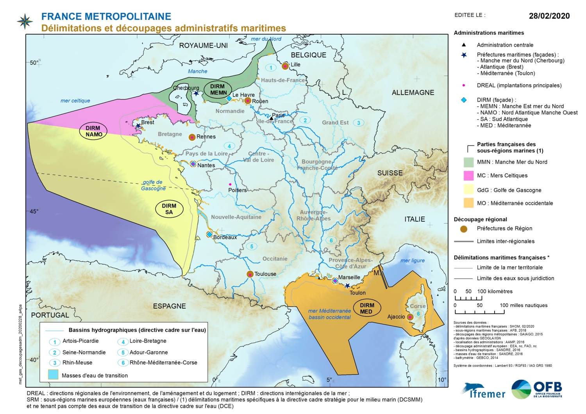
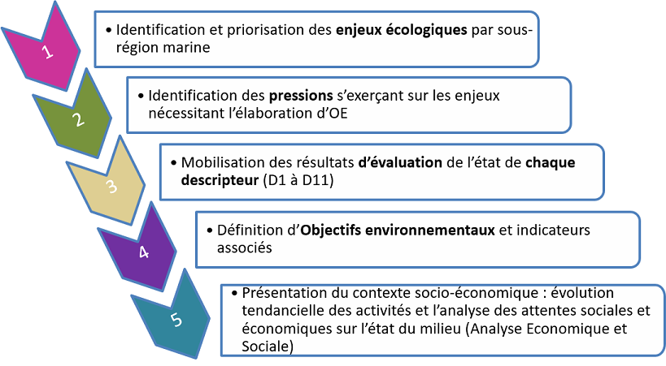

```{r compile, include=FALSE,eval=F,echo=F}
rmarkdown::render("support.Rmd")
```

```{r setup, include=FALSE}
knitr::opts_chunk$set(echo = FALSE)
```

## Information générale

Ce document présente les différentes politiques publiques et directives européennes qui encadrent la réglementation des usages du milieu marin. 
Il vient en support d’un cours destiné aux étudiants en Master 1 Gestion de l’Environnement / Risques et Environnement de l’université du Havre dans le cadre de l'UE Evaluation de la qualité écologique des milieux aquatiques. 
Ce cours est accompagné par un ensemble de travaux pratiques permettant d’appréhender la mise en oeuvre opérationnelle des directives utilisant essentiellement le logiciel R [@r2020] l’accès aux données marines ouvertes. 
Ce document est sous license libre, et plus précisement [MIT](https://fr.wikipedia.org/wiki/Licence_MIT).
Les chaînes de caractères [bleues](https://fr.wikipedia.org/wiki/Bleu) sont cliquables et contiennent des liens hypertextes renvoyant vers des ressources extérieures.
Les références telles que @baumer2014 renvoient vers la bibliographie en fin de document (cliquable si le document est en affichage long).

La navigation au sein de ce document html peut s'effectuer à l'aide des touches suivantes :

- flèches droite et gauche pour naviguer en mode présentation
- C : plan du document
- F : fait apparaître ou disparaître la barre d'état de la présentation
- A : affiche le document sous la forme d'une présentation ou d'un document long (facilite l'impression par exemple)
- B et S : augmente ou diminue la taille d'affichage des caractères

### Organisation

- 9 heures : 6h le 24 mars 2021 (9-12h puis 14-17h) et 3h le 25 mars 2021 (9h-12h)
- en visioconférence (liens zoom à venir)
- alternance de présentations et d'exercices pratiques avec des pauses régulières
- matériels : un ordinateur avec [RStudio Desktop](https://rstudio.com/products/rstudio/download/) 
installé, connection internet  

### Ressources 

Les ressources se trouvent ici : **<https://github.com/ldbk/DirEnvMar>** :

- le répertoire **cours** contient ce support en html et Rmarkdown
- le répertoire **TP** contient des ressources liées aux exemples pratiques
- le répertoire **img** contient les images illustrant ces supports


## L'intervenant

Laurent Dubroca (prénom.nom@ifremer.fr), Ifremer, laboratoire Ressources Halieutiques de Port-en-Bessin.

### [Ifremer](https://wwz.ifremer.fr/) ?

<div class='left' style='float:left;width:70%' text-align='justify'>
"L'Institut français de recherche pour l’exploitation de la mer (Ifremer) contribue, par ses travaux et expertises,
à la connaissance des océans et de leurs ressources, à la surveillance du milieu marin et littoral et au
développement durable des activités maritimes. L’Ifremer est source de connaissances, d’innovation, de
données de surveillance et d’expertise pour le monde de la mer, à la fois en matière de politique publique et
d’activité socio-économique. Il est la seule structure de ce type en Europe.
Fondé en 1984, l'Ifremer est un établissement public à caractère industriel et commercial (EPIC), placé sous
la tutelle conjointe des ministères de l'Enseignement supérieur et de la Recherche et de l'Environnement, de
l'Énergie et de la Mer."

**Composantes** : 5 centres et une vingtaine d'implantations dans le monde.

**Missions** : approche intégrée de la recherche en sciences marines

- appui à la puissance publique : pour le déploiement des politiques maritimes (directive cadre, pêche...)
- valorisation économique : partenariat avec le monde industriel ou économique, innovations et transfert de technologies
- recherche et développement : développements technologiques, infrastructures et moyens d'essais
- gestion de la flotte : gestion d'une partie de la flotte océanographique française (3/4 navires hauturiers, 3/7 navires côtiers et totalité des engins sous-marins et équipements lourds)
</div>

<div class='right' style='float:right;width:30%'>
```{r, echo=FALSE, out.width="100%", fig.cap=""}

```

```{r, echo=FALSE, out.width="100%", fig.cap=""}
knitr::include_graphics("../img/ifrmap.png")
```

```{r, echo=FALSE, out.width="100%", fig.cap=""}
knitr::include_graphics("../img/thalassa.jpg")
```
</div>

## Introduction

### Impact de l'homme sur le milieu marin ?

@halpern2008;@halpern2019 ont analysé ces impacts en cumulant différentes sources d'informations à l'échelle globale.

La résultante est le calcul d'un indice de des impacts cumulés de 14 "stressors" (température de l'eau, acidification, montée du niveau des mers, pêche...) sur 21 écosystèmes marins de 2003 à 2013 à 1km de résolution.


<div class='left' style='float:left;width:50%' text-align='justify'>
- une empreinte globale
- un taux de changement rapide
- des impacts multiformes liés à de nombreux usages 
</div>

<div class='right' style='float:right;width:41%'>

```{r, echo=FALSE, out.width="100%", fig.cap=""}

```

```{r, echo=FALSE, out.width="100%", fig.cap=""}

```
</div>


```{r, echo=FALSE, out.width="50%", fig.cap=""}

```

## Introduction

### Coût de la dégradation des écosystèmes pour l'Homme ?

Les services écosystèmiques contribuent au bien-être de l'humanité, directement (e.g. apport alimentaire) et indirectement (e.g. aspect patrimonial) [@costanza1997;@costanza2014].

Dans le cas des zones côtières : 

 - ces services convertis en unité monétaire sont estimés à 27,7 milliards de US dollards par hectare et par an.
 - exemples de services : nourriceries, recyclage des nutriments, culturel, régulation climatique...   
 
<div class='left' style='float:left;width:100%' text-align='justify'>
```{r, echo=FALSE, out.width="100%", fig.cap=""}
knitr::include_graphics("../img/costanza1.png")
```
</div>


## Introduction

### Une situation paradoxale donc

```{r, echo=FALSE, out.width="50%", fig.cap=""}
knitr::include_graphics("../img/ouroboros.png")
```


## Agir sur l'impact de l'Homme sur le milieu marin 

Comment concilier l'exploitation du milieu marin et le **bon état écologique** des écosystèmes afférents ?

Avant de répondre à cette question, nous établissons les définitions suivantes : 

- le **bon état écologique** correspond à un bon fonctionnement des écosystèmes (aux niveaux biologique, physique, chimique et sanitaire) permettant un usage durable du milieu marin.
- l'**approche écosystémique** de la gestion des impacts humains sur les écosystèmes marins est une gestion qui tient compte des besoins écologiques, économiques et sociaux.

Pour répondre à cette question, il est nécessaire d'établir :

- (1) la description des usages conduisant à l'exploitation du milieu marin par l'Homme
- (2) des critères objectifs permettant de déterminer le bon état écologique  
- (3) la mise en place des règles pour concilier usages et fonctionnement 

## Description des usages ?

<div class='left' style='float:left;width:50%' text-align='justify'>
- une empreinte globale
- un taux de changement rapide
- **des impacts multiformes liés à de nombreux usages**

Comment collecter des informations sur les usages dans un milieu où l'observation est coûteuse et complexe ?
- programme d'observations dédiées
- utiliser des informations existantes

-> Les données marines ouvertes
</div>

<div class='right' style='float:right;width:50%'>
```{r, echo=FALSE, out.width="100%", fig.cap=""}

```
</div>

## Description des usages : les portails de distribution des données marines

Il existe un grand nombre de portails nationaux et internationaux qui mettent à disposition un nombre conséquent d'information. Ces portails rationalisent l'observation du milieu marin en fédérant les coûts et fournissent des outils d'exploration cartographique des données.

- EMODNET (<https://www.emodnet.eu/>) : l'European Marine Observation and Data Network est un portail web distribuant des données marines et leurs métadonnées à travers différents sites thématiques. 
- Copernicus Marine Service (<https://marine.copernicus.eu/>) : un portail dédié aux données satellitaires et aux modèles numériques issues de l'océanographie physique.
- Le SIMM <https://www.milieumarinfrance.fr/Acces-aux-donnees> : service public d'information sur le milieu marin
- Sextant <https://sextant.ifremer.fr/> : infrastructure de données géographiques marines et littorales de l'Ifremer
- PODAAC (<https://podaac.jpl.nasa.gov/>) : le Physical Oceanography Distributed Active Archive Center est système d'information de la NASA dédié à la distribution des données sur les océans et le climat.
- ICES data portal  (<https://www.ices.dk/data/data-portals>) : l'Internatioanl Council for the Exploration of the Seas distribuent des données in situ collectées depuis 1 siècle par cette institution.

<div class='left' style='float:left;width:50%' text-align='justify'>
Quelques remarques :

- l'information disponible sur les portails semblent redondantes quelques fois : en réalité ces portails communiquent entre eux
- ces capacités de communication (nommées web services) permettent un traitement plus aisée de l'information : l'utilisateur demande directement l'information aux portails et récupérent la donnée sur la zone et la période qu'il intéresse
- ceci permet d'assurer la reproductibilité des résultats [@baumer2014] et assure que les données répondent à la notion [FAIR](https://fr.wikipedia.org/wiki/Fair_data) (Facile à trouve, Accessible,Interopérable et Réutilisable)

</div>

<div class='right' style='float:right;width:50%'>
```{r, echo=FALSE, out.width="100%", fig.cap=""}

```
</div>


## Des règles pour concilier usages et fonctionnement ?

Ces règles sont mises en place à travers la notion de règle de droit objectif, c'est à dire l'ensemble des règles juridiques qui régissent les hommes dans la vie en société, et dont la violation est sanctionnée par l'autorité publique. Ces règles incluent les lois, la constitution, les ordonnances, les décrets, les règlements et arrêtés, la coutume etc.

Pour le milieu marin français, la zone économique exclusive comportant 11.691.000 km" (soit la 1ère ou 2ème mondiale) est concernée par un très grand nombre de conventions et directives [@2021MilieuMarinFrance]: 

  - conventions internationales :  convention des Nations Unies sur le droit de la mer, convention sur la diversité biologique
  - conventions régionales : OSPAR, convention de Barcelone,...
  - zonation de l'espace maritime : aires marines protégée (AMP), Natura 2000 en mer
  - directives européennes: Directive Cadre sur l'Eau (DCE), Directive Cadre stratégie pour le milieu marin (DCSMM), Directive Cadre pour la planification de l'espace maritime (MSP)
  - politique commune des pêches européenne (PCP)
  - etc...

Ces structures sont très variables dans leurs fonctionnements et leurs mises en oeuvre. Il y a évidemment des passerelles juridiques et opérationnelles entre chacune d'elles.  

## Conventions et directives : conventions internationales

Conventions globales :

- la convention des Nations Unies sur le droit de la mer (CNUDM) : 
adoptée en 1982, définie un régime de droit global pour les océans et mers de la planète. Ratifiée par 168 états. Elle délimite les espaces maritimes sous juridiction nationale (zone économique exclusive à 200 milles marins). 3 organismes intergouvernementaux : la Commission des limites du plateau continental, le Tribunal international du droit de la mer et l’Autorité internationale des fonds marins. 

- La Convention sur la diversité biologique  (CDB) est un traité international juridiquement contraignant (1992). Il impose notamment aux États qui l’ont ratifié, d’établir des stratégies et plans d’action nationaux pour la biodiversité. 3 objectifs : conservation de la biodiversité (écosystèmes, espèces, ressources génétiques), utilisation durable, partage juste et équitables des ressources génétiques. Approche ecosystèmique mise en avant. Organe directeur de la CDB : la Conférence des Parties (COP).

Conventions des mers régionales :

- convention de Barcelone (1976, 2004): protection milieu marin et littoral de la Méditerranée. Gestion intégrée des zones côtières. Convention contre la pollution (1974) à la protection du milieu marin et du littoral de la Méditerranée (2004). Plan d’Action pour la Méditerranée : protection de l’environnement marin et côtier, et développement durable de l’espace méditerranéen. Approche écosystémique : "stratégie pour la gestion intégrée de la terre, de l’eau et des ressources vivantes, promouvant la conservation et l’utilisation durable de manière équitable".

- convention OSPAR (Oslo-Paris) pour la protection de l'environnement marin de l'Atlantique Nord-Est (1992) : convention de mer régionale basé sur un instrument légal pour la coopération internationale dédié à la protection de l’environnement marin.
Les travaux de la Convention sont menés par la Commission OSPAR (15 membres : Allemagne, Belgique, Danemark, Espagne, Finlande, France, Irlande, Islande, Luxembourg, Norvège, Pays-Bas, Portugal, Royaume-Uni, Suède, Suisse, Commission européenne). - mise en place en 1992, entrée en vigueur en 1998 la convention OSPAR combine et met à jour la convention d'OSLO de 1972 sur la gestion de déchets en mer et celle de Paris de 1974 sur la pollution du milieu marin issue des continents.
Approche écosystémique, approche qui doit "essentiellement permettre une exploitation durable des ressources naturelles tout en maintenant la qualité, la structure et le fonctionnement des écosystèmes marins" (OSPAR 2010), et par des stratégies thématiques pour répondre aux principales menaces identifiées.
- autres : convention de Carthagène (1983) pour la Protection et la Mise en Valeur du Milieu Marin dans la Région des Caraïbes (Guadeloupe, Martinique, St-Barthélemy, Saint-Martin, Guyane); convention de Nairobi (1985) pour la protection, la gestion et la mise en valeur du milieu marin et côtier de la région de l'Océan Indien occidental, la Convention pour la Conservation de la Faune et de la Flore Marines de l’Antarctique (CCAMLR, 1980), convention de Nouméa pour la Protection des Ressources Naturelles et de l’Environnement de la Région du Pacifique Sud (SPREP, 1986).    

```{r, echo=FALSE, out.width="100%", fig.cap="Pays ayant ratifié la convention de Barcelone"}

```

```{r, echo=FALSE, out.width="100%", fig.cap="Pays concernés par la convention OSPAR"}

```

## Conventions et directives : aires marines protégées et Natura 2000 en mer

- Aires Marines Protégée (AMP) : parties maritimes d'espaces protégés issues (1) de la transcription en droit national des directives européennes Oiseaux (1979, 2009) et Habitats Faune et Flore (1992) (2) d'instruments régionaux et internationaux (conventions de Barcelone, OSPAR, Carthagène...)
- Natura 2000 en mer : réseau européen dédié à la préservation de la biodiversité répondant aux directives européennes Oiseaux (1979, 2009) et Habitats Faune et Flore (1992). Assurer par une gestion concertée locale (collectivités, Etat, associations, pêcheurs...) la conservation et le rétablissement des habitats naturels d'espèces menacées.

```{r, echo=FALSE, out.width="100%", fig.cap=""}

```

## Conventions et directives : directives européennes

  - Directive Cadre sur l'Eau (DCE) : EU (2000), cadre pour une politique communautaire dans le domaine de l'eau (masses d'eaux continentales et littorales). Objectif : bon état général des eaux en 2027 à travers la définition d'élements de qualité (faune, flore, paramètres physico-chimiques), d'un programme de surveillance et d'indicateurs de qualité. [Carte pour la gestion opérationnelle](http://envlit.ifremer.fr/surveillance/directive_cadre_sur_l_eau_dce/la_dce_par_bassin>). Calendrier de mise oeuvre par cycle (fin 2ème cycle en 2021, 3ème cycle 2022-2017) : (1) état des lieux des bassins hydrographiques, (2) définition des plans de gestion (objectifs environnementaux et orientation pour les atteindre), (3) définiton du programme de mesures à adopter, (4) mise en oeuvre.
  
  - Directive Cadre stratégie pour le milieu marin (DCSMM) : EU avec facade littorale (2008). Concilier développement des activités humaines avec la préservation des écosystèmes. 11 descripteurs pour une approche écosystémique. 
En France mise ne oevure par les Plans d'Action du Milieu Marin (PAMM) dans chaque sous-région marine : (1) état initial, pressions, impacts, (2) définition du bon état écologique, (3) définition d’objectifs environnementaux et d’indicateurs associés, (4) programme de surveillance, (5) programme de mesure visant à atteindre les objectifs environnementaux. Le PAMM est défini par les conseils maritimes de façade (préfets, scientifiques, usagers, ONG, élus...) 
  
  - Directive Cadre pour la planification de l'espace maritime (DCPEM ou MSP pour Marine Spatial Planning) : EU (2014). Cadre pour la planification des activités maritimes et la gestion intégrée des zones côtières de l’espace européen. Les États membres doivent assurer une coordination des différentes activités humaines et usages en mer, pour atteindre des objectifs d’ordre écologique, économique et social. En France, mise en application par le Document Stratégique de Façade ([DSF](https://www.merlittoral2030.gouv.fr/)).
  
  
## Conventions et directives : politique commune des pêches

  - politique commune des pêches (PCP) : EU (23 Etats membres 1983). Gestion des ressources biologiques (pêche et aquaculture) exercée à l'EU (~90.000 navires de pêche, EU 1er importateur mondial). Deux enjeux majeurs : (1) accroître la productivité de la pêche et de l’aquaculture avec une exploitation durable des ressources halieutiques, (2) stabilité du marché et concurrence équitable (garanties de revenus). Outils : adapter la capacité de la flotte aux ressources et régulation des prélèvements (totaux admissibles de capture - TAC, limiter l'effort de pêche, mesures techniques : maille...).

## Directive Cadre stratégie pour le milieu marin (DCSMM) 

La [Directive Cadre stratégie pour le milieu marin](https://dcsmm.milieumarinfrance.fr) en détail :

- un texte : <https://dcsmm.milieumarinfrance.fr/content/download/4740/file/Directive_2008_56_CE.pdf> ou <https://eur-lex.europa.eu/legal-content/EN/TXT/?uri=celex%3A32008L0056>

- un résumé :
  - La DCSMM conduit les États membres de l’Union européenne à devoir prendre toutes les mesures nécessaires pour réduire les impacts des activités sur le milieu marin afin de maintenir ou restaurer un bon état fonctionnement des écosystèmes marins (diversité biologique conservée et interactions correctes entre les espèces et leurs habitats, océans dynamiques et productifs) tout en permettant l'exercice des usages en mer pour les générations futures dans une perspective de développement durable, et ce au plus tard en 2020.

  - milieu marin : eaux européennes ou « eaux situées au-delà de la ligne de base servant pour la mesure de la largeur des eaux territoriales et s'étendant jusqu'aux confins de la zone placée sous la souveraineté ou la juridiction des États membres, y compris le fond et le sous-sol de l'ensemble de ces eaux ». 3 millions de km2 sont concernés.

  - La motivation principale de la directive est de lutter contre les « nombreuses menaces qui pèsent sur le milieu marin, telles que l'appauvrissement ou la dégradation de la diversité biologique et les modifications de sa structure, la disparition des habitats, la contamination par les substances dangereuses et les substances nutritives, et les répercussions du changement climatique », ce qui nécessite un cadre global pour coordonner les actions locales des États membres. 


## Directive Cadre stratégie pour le milieu marin (DCSMM) : historique

- 2002-2003 : communication par la Commission Européenne intitulée « Vers une stratégie pour la protection et la conservation du milieu marin », validée par le Conseil Environnement du 4 mars 2003. 
- 2003-2005 : consultation des états membres, des pays tiers riverains, des 16 commissions et conventions internationales, de 21 grands organismes (scientifiques, industrie, société civile) pour la mise en place de cette stratégie :
- -> consensus sur le fait que des menaces nouvelles pèsent sur les milieux marins (pollutions, changement climatique, la surpêche, les marées noires et autres rejets d'hydrocarbures, l'introduction d'espèces non indigènes, l’eutrophisation, pollutions thermiques et sonores, contaminants microbiens et radioactifs, et déchets marins et portuaires)
- 2006 : la stratégie est traduite en «Proposition de Directive-cadre», examinée puis adoptée par le Conseil. 
- 14/11/2006 : lecture et discussion devant le parlement européen.
- 24/11/2006 : adoptée par le Conseil.
- 11/12/2007 : votée au parlement européen  puis validée par la Commission. 
- tranposition dans le droit français en mai 2011

## Directive Cadre stratégie pour le milieu marin (DCSMM) : objectif et mise en oeuvre

- « Le milieu marin est un patrimoine précieux qu'il convient de protéger, de remettre en état et de traiter comme tel, l'objectif final recherché étant de préserver la diversité biologique et le dynamisme des océans et des mers et d'en garantir la sûreté, la propreté, le bon état sanitaire et la productivité » (1er paragraphe).

- objectif : « l'utilisation durable des mers et la conservation des écosystèmes marins » via un cadre intégré fixant les orientations opérationnelles et des mesures spécifiques. Il s’agit d'« assurer de façon constante la protection et la conservation de ce milieu et à éviter sa détérioration » pour atteindre un « bon état écologique du milieu marin », au plus tard en 2021. 

- mise en oeuvre : Les États membres partageant une même région marine doivent élaborer « en coopération étroite » des plans garantissant le « bon état écologique » de leurs eaux maritimes, en s'appuyant sur des évaluations détaillées de l'état de l'environnement marin et en définissant des actions à entreprendre et des objectifs à atteindre. La subsidiarité est mise en avant, aucune mesure ne sera prise au niveau communautaire, mais les programmes nationaux seront contrôlés et approuvés par la Commission qui peut rejeter tout ou partie du cadre communiqué par un État membre si elle estime qu'il n'est pas conforme à la directive. 

```{r, echo=FALSE, out.width="50%", fig.cap=""}

```

## Directive Cadre stratégie pour le milieu marin (DCSMM) : objectif et mise en oeuvre

Trois types de mesures se complètent pour rendre la stratégie opérationnelle. Dans les milieux marins, les États membres devront : 

- protéger et conserver les écosystèmes, ou rétablir leur fonctionnement, les processus et la structure de la biodiversité. 
- prévenir et éliminer progressivement la pollution.
- contenir l'utilisation des services et des biens marins et les autres activités menées dans ce milieu à des niveaux compatibles avec les usages futurs et les écosystèmes marins. 

Plus précisement, chaque état membre par région marine doit :

- analyser les caractéristiques de leurs eaux marines pour déterminer les principaux impacts et pressions auxquels ces eaux sont soumises, leurs usages économiques et sociaux et le coût de la dégradation du milieu marin. L’évaluation initiale doit être terminée au plus tard 4 ans à compter de la date d'entrée en vigueur et porter sur les types d'habitats, les composantes biologiques, les caractéristiques physico-chimiques et l'hydromorphologie. 
- définir sur la base de l'évaluation initiale pour leurs eaux européennes le bon état écologique (évaluation initiale et définition du bon état écologique ; objectifs environnementaux ; programmes de surveillance ; programmes de mesures), dans les 4 ans à compter de la date d'entrée en vigueur.
- définir les objectifs environnementaux (dans les 5 ans à compter de la date d'entrée en vigueur).
- élaborer et mettre en oeuvre un programme de surveillance permanente et d'évaluation périodique de l'état des eaux en soumettant les travaux préparatoires et les programmes de mesures à l'approbation de la Commissio (au plus tard à 6 ans à compter de la date d'entrée en vigueur)
- élaborer un programme de mesures visant le bon état écologique (avant 2016 au plus tard), et lancer ce programme avant 2018 au plus tard. 

```{r, echo=FALSE, out.width="50%", fig.cap=""}

```


## Directive Cadre stratégie pour le milieu marin (DCSMM) : objectif et mise en oeuvre

Les écosystèmes marins étant « dynamiques et en évolution rapide », la directive prévoit des « mises à jour périodiques des stratégies pour le milieu marin ».

Chaque état devra mettre à jour les éléments de sa stratégie tous les 6 ans, sur la base d’une évaluation et d’un rapport intermédiaire décrivant les progrès réalisés dans la mise en oeuvre de ce programme, publié 3 ans après chaque mise à jour.

La stratégie de chaque état membre doit être soumise à l'observation des citoyens (convention d'Aarhus et directive 2003/35/CE). Consultation publiques des documents concernant : 

- évaluation initiale et définition du bon état écologique. 
- objectifs environnementaux. 
- programmes de surveillance. 
- programmes de mesures. 

Coopération : « En raison du caractère transfrontalier du milieu marin », la Directive invite les États membres à coopérer activement non seulement entre eux, mais avec les pays tiers concernés.

Directive en lien avec les autres directives environnementales (les directives habitats-faune-flore et oiseaux, la directive cadre sur l’eau) et sectorielles (politique commune des pêche), et maritime (planification de l'espace maritime).

Approche intégrée de la gestion du milieu : elle s’appuie sur un grand nombre d'actions existantes aux niveaux local, national, communautaire et international. Elle vise à les fédérer et les amplifier de manière cohérente.

Indicateurs : ils sont choisis par les États membres, qui doivent cependant les justifier au regard des objectifs de la directive, et de son annexe II. La directive a exclu de son champ le contrôle des rejets et des émissions résultant de l'utilisation de matières radioactives, car étant prévu par les articles 30 et 31 du traité EURATOM. 


```{r, echo=FALSE, out.width="100%", fig.cap=""}

```

## Directive Cadre stratégie pour le milieu marin (DCSMM) : objectif et mise en oeuvre

Comparaison avec d'autres cycles :

```{r, echo=FALSE, out.width="100%", fig.cap=""}

```

## Directive Cadre stratégie pour le milieu marin (DCSMM) : mise en oeuvre en France

- la France possède le second domaine maritime mondial (11 millions de km2).
- sa responsabilité est fortement engagée dans la mise en œuvre de la directive. 

En France, le Grenelle de la mer (2009) a proposé au Gouvernement de nouveaux outils et cadres juridiques pour mieux appliquer cette directive, en particulier la création de conseils maritimes de façade et de documents stratégiques de façade. La loi dite « Grenelle 2 » du 12 juillet 2010 met en place le nouveau dispositif. Chaque document stratégique de façade (DSF) comprendra un volet consacré à la mise en œuvre de la directive cadre, via les plans d'action pour le milieu marin.

La DCSMM a été transposée dans le code de l’environnement en 2011 (articles L 219-9 à L 219-18 et R 219-2 à R 219-17) et s’applique aux zones sous souveraineté ou juridiction française, divisées en 4 sous-régions marines : la Manche-Mer du Nord, les mers celtiques, le golfe de Gascogne et la Méditerranée occidentale. Elle ne s'applique pas à l’outre-mer.

```{r, echo=FALSE, out.width="100%", fig.cap=""}

```

En 2012 (évolution des régions après évaluation) :

```{r, echo=FALSE, out.width="100%", fig.cap=""}

```


## Directive Cadre stratégie pour le milieu marin (DCSMM) : mise en oeuvre en France

Le Plan d'Action pour le Milieu Marin (PAMM)

Pour chaque sous-région marine, les autorités compétentes doivent élaborer et mettre en œuvre, en association avec les acteurs concernés, un PAMM composé de cinq éléments, révisables tous les six ans :

- évaluation initiale des eaux marines (usages, pressions correspondantes, impacts sur les milieux marins, état de ces derniers et coût de la dégradation observée) réalisée en 2012.
- définition du bon état écologique pour ces mêmes eaux.
- définition d’objectifs environnementaux et d’indicateurs associés en vue de parvenir au bon état écologique.
- programme de surveillance en vue de l’évaluation permanente de l’état des eaux marines et de la mise à jour périodique des objectifs environnementaux.
- programme de mesures qui permette d’atteindre les objectifs environnementaux.

Le PAMM est intégré dans le Document Stratégique de Facade répondant aux besoins de la directive MSP depuis 2017.

```{r, echo=FALSE, out.width="100%", fig.cap=""}

```

## Directive Cadre stratégie pour le milieu marin (DCSMM) : mise en oeuvre en France

Le Plan d'Action pour le Milieu Marin (PAMM):

<div class='left' style='float:left;width:50%'>
- objectifs environnementaux : ils visent à ramener les pressions exercées par les activités humaines sur le milieu marin à des niveaux compatibles avec le maintien et l’atteinte du bon état écologique des eaux marines à l’échéance du cycle en cours de la DCSMM. Associées à des indicateurs qualitatifs et des cibles définies. 
- programmes de mesures : actions concrètes et opérationnelles mises en oeuvre pour atteindre ou maintenir le bon état écologique (exemple : aire marine protégée, action sur les déchets solides au niveau du bassin versant, etc.)
</div>
<div class='right' style='float:right;width:50%'>
```{r, echo=FALSE, out.width="100%", fig.cap=""}

```{r, echo=FALSE, out.width="100%", fig.cap=""}

```
</div>

## Directive Cadre stratégie pour le milieu marin (DCSMM) : mise en oeuvre en France

Les objectifs du Plan d'Action pour le Milieu Marin (PAMM)

- Assurer la protection, la conservation et éviter la détérioration des écosystèmes marins. Là où une forte dégradation est observée, le fonctionnement des écosystèmes doit être rétabli.
- Prévenir et éliminer progressivement la pollution.
- Maintenir la pression des activités humaines (pêche, utilisation de services divers…) sur le milieu marin à un niveau qui soit compatible avec la réalisation du bon état écologique. Les écosystèmes doivent pouvoir réagir aux divers changements de la nature et des hommes, tout en permettant une utilisation durable du milieu pour les générations futures (Politique Commune des Pêches par exemple).

Gouvernance :

- nationale : ministère chargé de l'environnement (direction de l’eau et de la biodiversité ) et et au niveau de chaque sous-région marine (préfets coordonnateurs de façades maritimes).
- par façade maritime : prefets et directions interrégionales de la mer (DIRM) Manche Est-mer du Nord, Nord-Atlantique Manche-Ouest, Sud Atlantique et Méditerranée.
- appuis scientifiques et techniques : coordination nationale par l'Ifremer et l'Office Français de la Biodiversité (OFB), et un grand nombre de partenaires scientifiques (universités, SHOM, ANSES, MNHM...).
- enfin le PAMM est soumis à la Commission Européenne qui évalue sa conformité à la directive et sa cohérence au sein des sous-régions marines et dans l'ensemble de la Communauté.

## Directive Cadre stratégie pour le milieu marin (DCSMM) : bon état écologique et descripteurs

La définition du bon état écologique est issue de travaux scientifiques et techniques menés depuis 2010 par un ensemble d’établissements publics (ANSES, BRGM, CNRS, IFREMER, MNHN, SHOM) sous la coordination scientifique et technique de l’IFREMER et de l’OFB.

Onze descripteurs qualitatifs, communs à tous les États membres de l’Union européenne, servent à définir le bon état écologique :  

    Descripteur 1 : la diversité biologique. La qualité des habitats et leur nombre ainsi que la distribution et l’abondance des espèces doivent être adaptés aux conditions physiographiques, géographiques et climatiques existantes.
    
    Descripteur 2 : les espèces non indigènes. Les espèces introduites par le biais des activités humaines doivent se maintenir à des niveaux qui ne perturbent pas les écosystèmes.
    
    Descripteur 3 : les espèces exploitées. Les populations de poissons et crustacés exploités à des fins commerciales doivent se situer dans les limites de sécurité biologique et présenter une répartition
    de la population par âge et par taille qui témoigne de la bonne santé du stock.
    
    Descripteur 4 : le réseau trophique marin. Les composants connus de la chaîne alimentaire marine doivent être présents en abondance et diversité normales, et à des niveaux pouvant garantir le maintien complet des capacités reproductives des espèces à long terme.
    
    Descripteur 5 : l’eutrophisation. Cette forme de pollution d’origine humaine, qui induit appauvrissement de la biodiversité, dégradation des écosystèmes, prolifération d’algues toxiques et désoxygénation des eaux
    de fond doit être réduite au minimum.
    
    Descripteur 6 : l’intégrité des fonds marins. La structure et les fonctions des écosystèmes doivent être préservées et les écosystèmes benthiques, en particulier, ne pas être perturbés.
    
    Descripteur 7 : les conditions hydrographiques. Une modification permanente des conditions hydrographiques ne doit pas nuire aux écosystèmes marins.
    
    Descripteur 8 : les contaminants. Leur niveau de concentration ne doit pas avoir de conséquence.
    
    Descripteur 9 : les questions sanitaires. Les quantités de contaminants présents dans les poissons et autres fruits de mer destinés à la consommation humaine ne doivent pas dépasser les seuils fixés par la législation communautaire ou autres normes applicables.
    
    Descripteur 10 : les déchets marins. La nature et les quantités de déchets marins ne doivent pas provoquer de dommages au milieu côtier et marin.
    
    Descripteur 11 : l’énergie marine. L’introduction d’énergie, y compris de sources sonores sous-marines, doit s’effectuer à des niveaux qui ne nuisent pas au milieu marin.

```{r, echo=FALSE, out.width="50%", fig.cap=""}
knitr::include_graphics("../img/desc.png")
```

## Cloner un répertoire git depuis github sur son ordinateur

Avant tout il est nécessaire d'installer git <https://gitforwindows.org/>.

### Etape 1
```{r, echo=FALSE, out.width="100%", fig.cap="."}

```
### Etape 2

Aller dans fichier -> nouveau projet

```{r, echo=FALSE, out.width="100%", fig.cap="."}

```
### Etape 3

Choisir Version Control

```{r, echo=FALSE, out.width="100%", fig.cap="."}

```
### Etape 4

Choisir Git
```{r, echo=FALSE, out.width="100%", fig.cap="."}

```
### Etape 5

- renseigner le lien vers le répertoire : **https://github.com/ldbk/DirEnvMar.git**
- renseigner le répertoire d'accueil (avec browse/choisir par exemple)
- cocher **ouvrir dans une nouvelle session** en bas à gauche
- puis cliquer créer projet

```{r, echo=FALSE, out.width="100%", fig.cap="."}

```
### Etape 6

Synchronisation en cours !

```{r, echo=FALSE, out.width="100%", fig.cap="."}

```
### Etape 7

Bravo.
```{r, echo=FALSE, out.width="100%", fig.cap="."}

```

## Un rapport automatique en Rmarkdown

### Etape 1

Dans RStudio -> fichier -> nouveau fichier -> R Markdown
```{r, echo=FALSE, out.width="100%", fig.cap="."}

```
### Etape 2

Cliquer sur OK
```{r, echo=FALSE, out.width="100%", fig.cap="."}

```
### Etape 3

Un document Rmarkdown prédéfini est créé.
```{r, echo=FALSE, out.width="100%", fig.cap="."}

```
### Etape 4

Cliquer sur knit (on peut préciser le répertoire de travail dans les options de ce menu)
```{r, echo=FALSE, out.width="100%", fig.cap="."}

```
### Etape 5

Choisir où le document est sauvé sur le disque dur de votre ordinateur.
```{r, echo=FALSE, out.width="100%", fig.cap="."}

```
### Etape 6

Un document html est généré. Bravo.
```{r, echo=FALSE, out.width="100%", fig.cap="."}

```
## Canevas slidy
<div class='left' style='float:left;width:48%'>
code or image for left of slide
</div>
<div class='right' style='float:right;width:48%'>
```{r, echo=FALSE, out.width="50%", fig.cap="."}
knitr::include_graphics("../img/desc.png")
```
</div>

## Bibliographie
